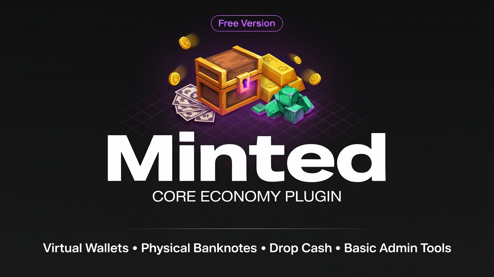
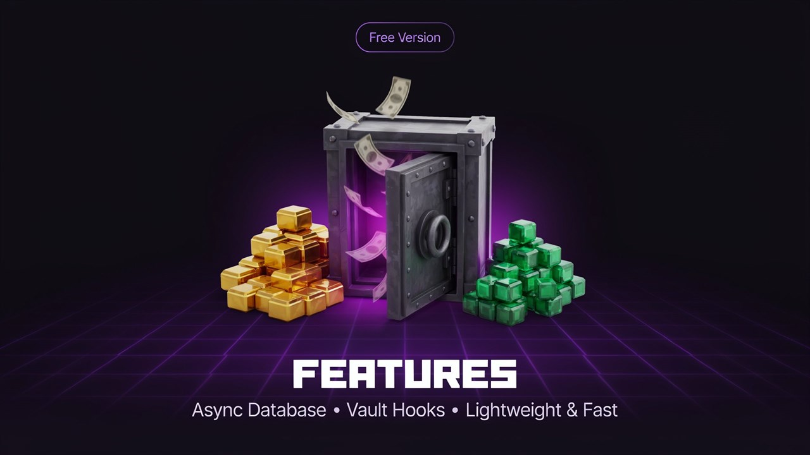
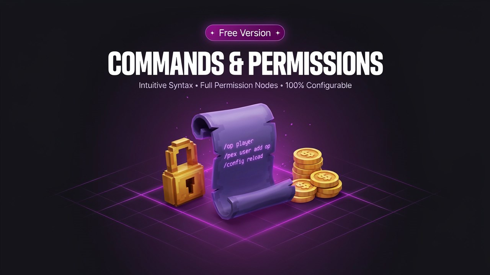

# Minted Free

A GUI-first economy plugin for premium survival and roleplay servers.
**Status:** `v0.62.0`

<p align="center">
  
</p>

Minted ships **1.8 through 1.26 in a single jar**. No separate JARs per
version, no per-version shims duplicated in feature code. Everything
version-sensitive routes through the `compat` layer, and `api-version: 1.13`
in `plugin.yml` opts out of the server's legacy-material mode so modern item
names resolve everywhere. On startup Minted self-checks the whole alias table
(`Material probe: 20/20`).

## Downloads

Latest release (with jar attached): <https://github.com/IYanel-DEV/Minted-Free/releases>

## Features

<p align="center">
  
</p>

### Money

- **Two balances** - a bank and a wallet per player, with
  `integrations.primary-balance` deciding which one Vault, PlaceholderAPI and
  the public API see.
- **Physical cash** - paper banknotes you carry and spend (`/wallet`), with an
  optional resource pack for custom textures, *or* a classic digital balance
  (`economy.physical: false`). Notes are signed, so edited or forged notes are
  rejected on redeem.
- **Banking** - interest, loans with fees and late fees, withdrawal/transfer
  fees, and player-to-player requests (`/pay` and the clickable request
  message).
- **Payment source of your choice** - `/minted source wallet|bank|both`.
  `both` pays from the wallet and falls back to the **full amount** from the
  bank when the wallet cannot cover it. A bank-funded purchase starts a
  short delivery cooldown (`payments.bank-cooldown-seconds`, default 7),
  announced in chat; wallet purchases are never blocked.
- **Multi-currency** - an optional base currency with exchange rates for
  shops and auctions (`/currency`).
- **Stats** - server-wide totals, rich list and burn tracking (`/mstats`), and
  a personal ledger per player (`/mhistory`).

### Trading

- **Global shops** (`/eshop`) with a seeded, version-safe catalog.
- **Community marketplace** - anyone lists stock at their own price, with
  buy-back, stock and earnings tracking.
- **Player shops** (`/pshop`) - personal storefronts with their own pages,
  prices and earnings.
- **Auction house** (`/ah`) - timed listings, bids, buyouts, expiry and
  collection.
- **Sell** - `/sell [amount|all|menu]`; sell-all handles every distinct stack
  you hold in one click.
- **Bounties** (`/bounty`) - post, track, claim, refund and expire.
- **VIP shops** - a VIP who owns a player shop automatically gets a
  `/<username>` command that opens it for anyone who types it. Manage VIPs with
  `/minted vip add|remove|list`, the dashboard's VIP page, or the
  `minted.vip` permission (LuckPerms and friends).

### Server owner

- **Admin dashboard** (`/minted dashboard`) - economy overview, VIP manager,
  account inspector, shop and bounty shortcuts.
- **Admin commands** - `/eco give|take|set|reset`, balance export/import, and
  `/minted report` for a live look at every integration.
- **Bank tellers** - self-built ProtocolLib NPCs (`/minted npc`). No Citizens
  dependency. New tellers default to a yellow *Banker* name and a
  mustachioed bank-man-in-a-suit skin, both configurable under
  `integrations.npcs`.
- **12 languages** out of the box (English, Arabic, German, Spanish, French,
  Italian, Japanese, Korean, Polish, Portuguese, Russian, Chinese) with
  `/language` and per-player or server-wide selection.

### Infrastructure

- **One jar for Minecraft 1.8 - 1.26.** No per-version downloads; everything
  version-sensitive routes through the compat layer.
- **Storage** - SQLite out of the box, MySQL/MariaDB for networks. Fully async;
  the server thread never waits on disk or the network.
- **Multi-server networks** - point every server at the same MySQL database and
  enable `multi-server`: balances are written as atomic deltas (two servers can
  never overwrite or double-spend each other), players are re-read on join, and
  optional Redis pub/sub announces changes instantly.
- **Public API** - `MintedAPI`/`MintedEconomy` plus
  `MintedBalanceChangeEvent` for your own plugins.
- **Custom items** - ItemsAdder, Nexo and Oraxen items keep their own identity
  in shops, `/sell` and the marketplace (detected automatically, no
  dependency).
- **Integrations** - Vault **and VaultUnlocked** (the vault2 API),
  PlaceholderAPI, EssentialsX awareness, ProtocolLib, ViaVersion and bStats -
  every one optional, guarded, and degrading cleanly when absent.

## Quick start

1. Drop `Minted-<version>.jar` in `plugins/` and start the server. SQLite works
   with zero configuration.
2. Try `/minted gui` - the personal hub with balance, bank, wallet, stats and
   requests.
3. `/balance`, `/pay <player> <amount>`, `/bank`, `/wallet` work immediately.
4. For a network: set `database.type: mysql` and `multi-server.enabled: true` on
   every server (optionally a shared `redis://` URI), then check
   `/minted report`.

<p align="center">
  
</p>

## Commands

| Command | Aliases | What it does |
| --- | --- | --- |
| `/minted` | `/mint` | Help, personal GUI, and the admin surface |
| `/balance [player]` | `/bal`, `/money` | Check a balance |
| `/pay <player> <amount>` | | Send money, or request it with a clickable message |
| `/bank [deposit\|withdraw]` | | Open your bank |
| `/wallet` | | Get and open your wallet of banknotes |
| `/sell [amount\|all\|menu]` | | Sell the item in hand, everything, or open the picker |
| `/eshop [shop\|create\|delete\|edit\|reload]` | `/shop`, `/shops` | Browse and administer global shops |
| `/pshop [create\|add\|sell\|my\|open\|browse\|delete]` | | Run your own player shop |
| `/ah [create\|my\|bids\|expire\|cancel]` | `/auction` | Auction house |
| `/bounty <player> <amount> [note]` | | Post and track bounties |
| `/mstats` | `/economy` | Server-wide economy statistics |
| `/mhistory` | `/history` | Your transaction history |
| `/language [set\|list\|global\|reload]` | `/lang` | Per-player or server-wide language |
| `/eco [give\|take\|set\|reset\|export\|import]` | | Console-only balance administration |

Admin subcommands of `/minted`: `dashboard` (admin overview), `vip add|remove|list`
(VIPs and their `/username` shop commands), `npc create|remove|here|list` (bank
tellers), `reload`, `report`.

## Permissions

| Node | Default | Grants |
| --- | --- | --- |
| `minted.use` | everyone | Access to the Minted economy |
| `minted.balance` / `minted.balance.others` | everyone / op | Own / other balances |
| `minted.pay` | everyone | Pay other players |
| `minted.bank` / `minted.wallet` / `minted.sell` | everyone | Bank, wallet, selling |
| `minted.shop.use` / `minted.shop.own` / `minted.shop.admin` | everyone / everyone / op | Trading, own shop, shop administration |
| `minted.bounty` / `minted.stats` / `minted.history` | everyone | Bounties, stats, history |
| `minted.vip` | false | Counts as VIP: the automatic `/<username>` shop command |
| `minted.admin` | op | Dashboard, reload, report, VIP management, bank tellers |
| `minted.eco` | op, console only | `/eco` balance administration |

## Compatibility

| | Supported |
| --- | --- |
| Minecraft | 1.8 - 1.26 (one jar) |
| Servers | Spigot, Paper and forks |
| Storage | SQLite (default), MySQL / MariaDB |
| Networks | BungeeCord / Velocity via `multi-server` (Redis optional) |
| Economy API | Vault, VaultUnlocked (vault2) |
| Optional plugins | PlaceholderAPI, EssentialsX, ProtocolLib, ViaVersion, ItemsAdder, Nexo, Oraxen |

## Configuration highlights

Everything lives in one commented `config.yml`; the blocks you are most likely
to touch:

```yaml
database:
  type: "sqlite"          # or "mysql" for networks
  # host / port / database / username / password / pool-size

multi-server:             # shared database across servers
  enabled: false
  redis: ""               # e.g. redis://localhost:6379 (optional)
  save-seconds: 2         # how fast changes reach the database
  refresh-seconds: 15     # self-heal re-read interval

vip:
  enabled: true           # /<username> shop commands

integrations:
  vault:
    register: false       # make Minted the Vault economy provider
  vaultunlocked:
    register: false       # ...on the vault2 API
  customitems:
    enabled: true         # ItemsAdder / Nexo / Oraxen identity
```

## Testing

Minted ships one self-test catalogue (`dev.minted.selftest`) with two runners,
so "correct" is defined exactly once:

- **At build time** - `.\mvnw.cmd test` (or simply `.\mvnw.cmd clean package`,
  which runs it too). Covers the money rules: amount tokens, deposit/withdraw
  and the cap, the admin-set path, the remote-sync path, and a two-server
  simulation proving that concurrent balance changes compose instead of
  overwriting each other, that an overdraft is refused, and that a stale cache
  can never push a balance past the cap.
- **On a running server** - `/minted selftest` (admin) runs the same checks
  plus the parts only a live server can prove: a real guarded-delta round-trip
  against your database (cleaned up afterwards), the public economy API, the
  loaded shop model, every command executor, the VIP list, detected custom-item
  providers and the Redis announcement channel. Results are printed in chat
  and logged to the console.

## Building

Requires JDK 8+ (JDK 17+ recommended). The wrapper pins Maven for you.

```
# Linux / macOS
./mvnw clean package

# Windows
.\mvnw.cmd clean package
```

Output: `target/Minted-<version>.jar`

## Layout

| Package | Purpose |
| --- | --- |
| `dev.minted` | Plugin entry point, lifecycle wiring |
| `dev.minted.command` | Command registration and dispatch |
| `dev.minted.backend` | Async SQL storage (sqlite/mysql) over a shaded Hikari pool |
| `dev.minted.bank` | Balances, transfers, loans, interest, fees and the batched save loop |
| `dev.minted.banknote` | Paper banknotes: mint, verify, redeem |
| `dev.minted.ledger` | Personal transaction history (`/mhistory`) |
| `dev.minted.auction` | Auction house: listings, bids, buyouts, expiry (`/ah`) |
| `dev.minted.currency` | Multi-currency definitions and conversion |
| `dev.minted.gui` | Reusable inventory-menu framework and chat prompts |
| `dev.minted.shop` | Shops: model, storage, `/eshop`, `/pshop`, menus, buy/sell trade, sell-all, sales feed |
| `dev.minted.bounty` | Player bounties: post, board, kill-claims, refunds and expiry |
| `dev.minted.wallet` | The wallet item: carry and pay directly from banknotes |
| `dev.minted.resourcepack` | Optional banknote custom-texture prompt (1.14+) |
| `dev.minted.sound` | Version-safe money moment sounds |
| `dev.minted.request` | Player-to-player money requests |
| `dev.minted.lang` | Language bundles (12 packs) with English fallback |
| `dev.minted.api` | Public economy API, events, MintedEconomy (Vault/PlaceholderAPI hook) |
| `dev.minted.integration` | Optional hooks (Vault, VaultUnlocked, PlaceholderAPI, NPC tellers, ViaVersion, custom items) |
| `dev.minted.vip` | VIP list and the automatic `/<username>` shop commands |
| `dev.minted.network` | Multi-server coordination and the dependency-free Redis announcements |
| `dev.minted.compat` | `ServerVersion`, `MaterialLookup` - version parsing, item/material resolution |
| `dev.minted.util` | Version-safe reflection helpers for NMS access |

## Design rules

- **Compile against 1.8.8 API.** The `pom.xml` pins `spigot-api:1.8.8` as its
  only dependency, so everything referenced here is guaranteed to exist at
  runtime from 1.8 upward. Newer-server material is reached through the compat
  layer, never through direct API calls.
- **`api-version: 1.13` in `plugin.yml`.** Opts out of the server's
  legacy-material mode, so modern `Material` constants (`OAK_PLANKS`, `RED_WOOL`,
  ...) resolve on the single jar. Paper/Spigot ignore the value on 1.12 and
  below, so the 1.8 -> 1.26 range is unaffected. `MaterialLookup` keeps a
  per-version rename map (e.g. `chain` -> `IRON_CHAIN`) and logs a diagnostic
  probe at startup.
- **Fully async storage** is a hard requirement from the start; the backend
  milestone must never touch the main thread on disk or on the wire.
- **No required dependencies.** Every third-party hook (ProtocolLib, Vault,
  PlaceholderAPI, ViaVersion) is optional, guarded, and degrades to a sane
  default when absent.

## Commandments for contributors

1. No new Bukkit API call resulting from a later version than 1.8.8 in *core*
   code paths - if it is not available on 1.8, it goes behind an adapter.
2. Never couple feature code to `org.bukkit.craftbukkit` or `net.minecraft.*`
   directly. Use `dev.minted.util.Reflection`.
3. Keep every database operation off the main thread.

## Contributors

<p align="right">
  <a href="https://github.com/Iyouniss"></a>
  <a href="https://github.com/iyanel01"></a>
  <a href="https://github.com/vexx-rain"></a>
  <a href="https://github.com/IYanel-DEV"></a>
</p>

## Support and links

- Releases and downloads: <https://github.com/IYanel-DEV/Minted-Free/releases>
- Source and issues: <https://github.com/IYanel-DEV/Minted-Free>
- In game, `/minted report` prints the live state of every integration - the
  fastest way to diagnose "why isn't X hooked".
- Anonymous usage stats (bStats, id 34228) can be disabled in
  `plugins/bStats/config.yml`; no balance or player data is ever collected. 

 

 

 

